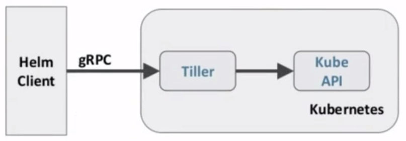

#### 什么是 Helm

---

###### 在没使用 helm 之前, 向 kubernetes 部署应用, 我们要依次部署 deployment、svc 等, 步骤较繁琐. 况且随着很多项目微服务化, 复杂的应用在容器中部署以及管理显得较为复杂, helm 通过打包的方式, 支持发布的版本管理和控制, 很大程度上简化了 kubernetes 应用部署和管理

###### Helm 本质就是让 k8s 的应用管理 (Deployment, Service 等) 可配置, 能动态生成. 通过动态生成 k8s 资源清单 (deployment.yaml, service.yaml). 然后调用 kubectl 自动执行 k8s 资源部署

###### Helm 是官方提供的类似于 YUM 的包管理器, 是部署环境的流程封装. Helm 有两个重要的概念: chart 和 release

- chart 是创建一个应用的信息集合, 包括各种 kubernetes 对象的配置模板、参数定义、依赖关系、文档说明等. chart 是应用部署的自包含逻辑单元. 可以将 chart 想象成 apt、yum 中的软件安装包
- release 是 chart 的运行实例, 代表了一个正在运行的应用. 当 chart 被安装到 kubernetes 集群, 就生成一个 release. chart 能够多次安装到同一个集群, 每次俺咋混个都是一个 release

###### Helm 包含两个组件: Helm 客户端和 Tiller 服务器, 如下图所示



###### Helm2 客户端负责 chart 和 release 的创建和管理以及和 Tiller 交互. Tiller 服务器运行在 kubernetes 集群中, 它会处理 helm 客户端的请求, 与 kubernetes API Server 交互

#### Helm 部署

---

###### 越来越多的公司和团队开始使用 Helm 这个 kubernetes 的包管理器, 我们也将使用 Helm 安装 Kubernetes 的常用组件. Helm 由客户端 helm 命令行工具和服务端 tiller 组成, helm 的安装十分简单. 下载 helm 命令行工具到 master 节点 node01 的 /usr/local/bin 下, 这里下载的 2.13.1 版本:

```bash
ntpdate ntp1.aliyun.com
wget https://storage.googleapis.com/kubernetes-helm/helm-v2.13.1-linux-amd64.tar.gz
tar zxf helm-v2.13.1-linux-amd64.tar.gz
cd linux-amd64
mv helm /usr/local/bin/
chmod +x /usr/local/bin/helm
```

###### 为了安装服务端 tiller 还需要在这台机器上配置好 kubectl 工具和 kubeconfig 文件, 确保 kubectl 工具可以在这台机器上访问 APIServer 且正常使用.

###### 因为 Kubernetes APIServer 开启了 RBAC 访问控制, 所以需要创建 tiller 使用的 service account: tiller 并分配合适的角色给它. 详细内容可以查看 helm 文档中的 

[Role-based Access Control](https://helm.sh/docs/topics/rbac/). 这里简单起见直接分配 cluster-admin 这个集群内置的 ClusterRole 给它. 创建 rbac-config.yaml 文件:

```yaml
apiVersion: v1
kind: ServiceAccount
metadata:
  name: tiller
  namespace: kube-system
---
apiVersion: rbac.authorization.k8s.io/v1beta1
kind: ClusterRoleBinding
metadata:
  name: tiller
roleRef:
  apiGroup: rbac.authorization.k8s.io
  kind: ClusterRole
  name: cluster-admin
subjects:
- kind: ServiceAccount
  name: tiller
  namespace: kube-system
```

```bash
kubectl create -f rbac-config.yaml

# 下载 tiller 镜像
docker pull sapcc/tiller:v2.13.1
docker tag docker.io/sapcc/tiller:v2.13.1 gcr.io/kubernetes-helm/tiller:v2.13.1
docker rmi -f sapcc/tiller:v2.13.1

# 启动 tiller
helm init --service-account tiller --skip-refresh
```

###### tiller 默认被部署在 k8s 集群中的 kube-system 这个 namespace 下

```bash
kubectl get pod -n kube-system -l app=helm

helm version
```

#### Helm 自定义模板

---

```bash
mkdir hello-world
cd hello-world

# 创建自描述文件
cat << EOF > Chart.yaml
name: hello-world
version: v1
EOF

# 创建模板文件
mkdir templates
cat << EOF > templates/deployment.yaml
apiVersion: extensions/v1beta1
kind: Deployment
metadata:
  name: hello-world
spec:
  replicas: 1
  template:
    metadata:
      labels:
        app: hello-world
    spec:
      containers:
      - name: hello-world
        image: harbor.ninejy.io/library/myapp:v1
        ports:
        - containerPort: 80
          protocol: TCP
EOF

cat << EOF > templates/service.yaml
apiVersion: v1
kind: Service
metadata:
  name: hello-world
spec:
  type: NodePort
  ports:
  - port: 80
    targetPort: 80
    protocol: TCP
  selector:
    app: hello-world
EOF
```

```bash
# 创建 Release
helm install .

# 列出已经部署的 Release
helm ls
helm list

# 查看一个特定 Release 的状态
helm status ${RELEASE_NAME}

# 更新
helm upgrade ${RELEASE_NAME} .

helm delete ${RELEASE_NAME}

helm ls --deleted

helm rollback ${RELEASE_NAME} ${REVISION_NUMBER}

helm history ${RELEASE_NAME}

helm delete --purge ${RELEASE_NAME}
```

```bash
# 镜像名字版本可以抽取出来
cat << EOF > values.yaml
image:
  repository: harbor.ninejy.io/library/myapp
  tag: 'v2'
EOF

cat << EOF > templates/deployment.yaml
apiVersion: extensions/v1beta1
kind: Deployment
metadata:
  name: hello-world
spec:
  replicas: 1
  template:
    metadata:
      labels:
        app: hello-world
    spec:
      containers:
      - name: hello-world
        image: {{ .Values.image.repository }}:{{ .Values.image.tag }}
        ports:
        - containerPort: 80
          protocol: TCP
EOF

helm upgrade ${RELEASE_NAME} .

# 也可以命令行传参
helm install --set image.tag='v2'
```

#### Debug

---

```bash
# 使用模板动态生成 k8s 资源清单, 提前预览生成的结果
# 使用 --dry-run --debug 选项来打印生成的清单文件内容, 而不执行部署
helm install . --dry-run --debug --set image.tag='v3'
```
